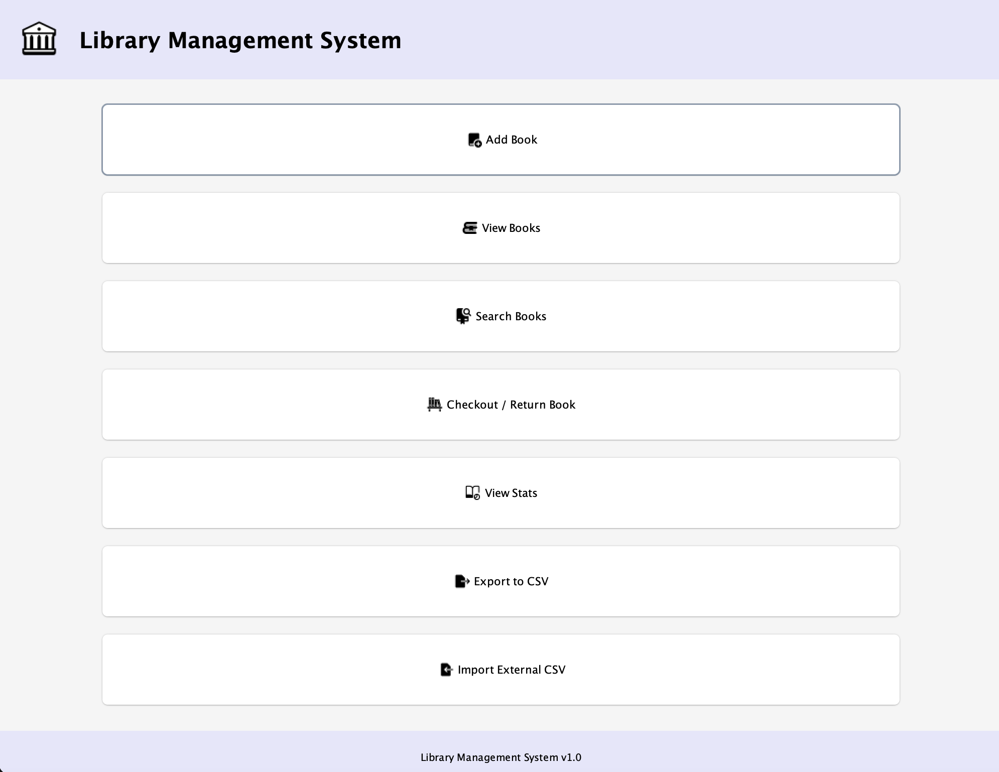
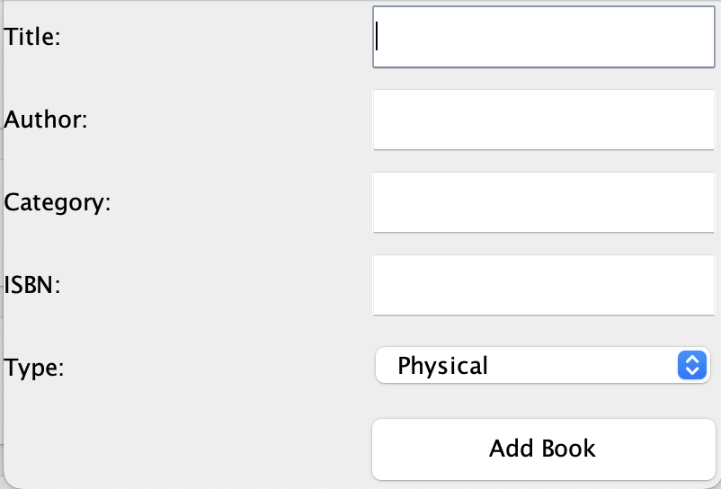
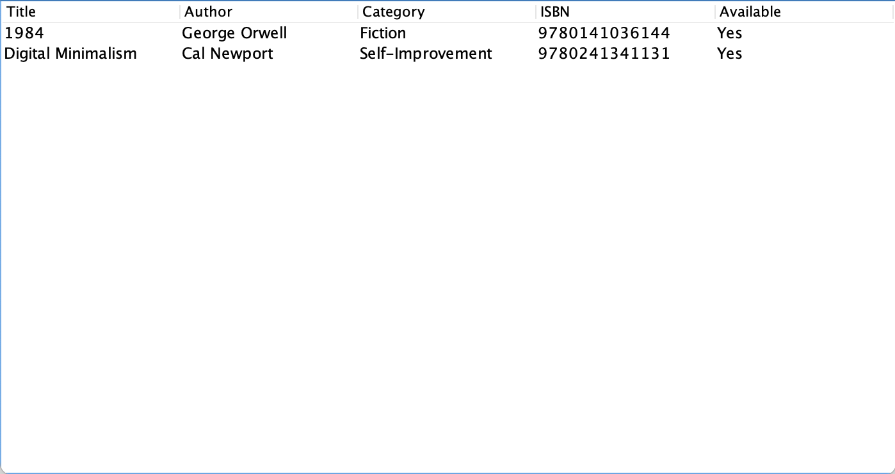
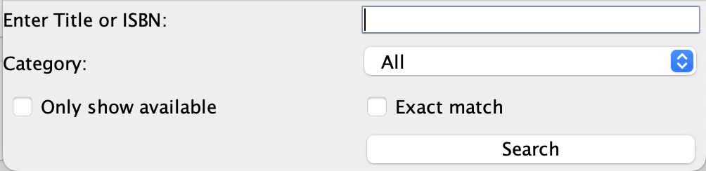
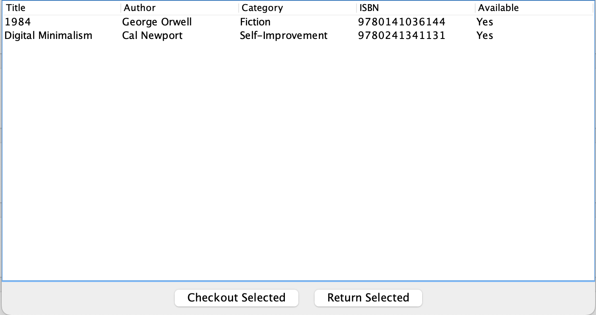
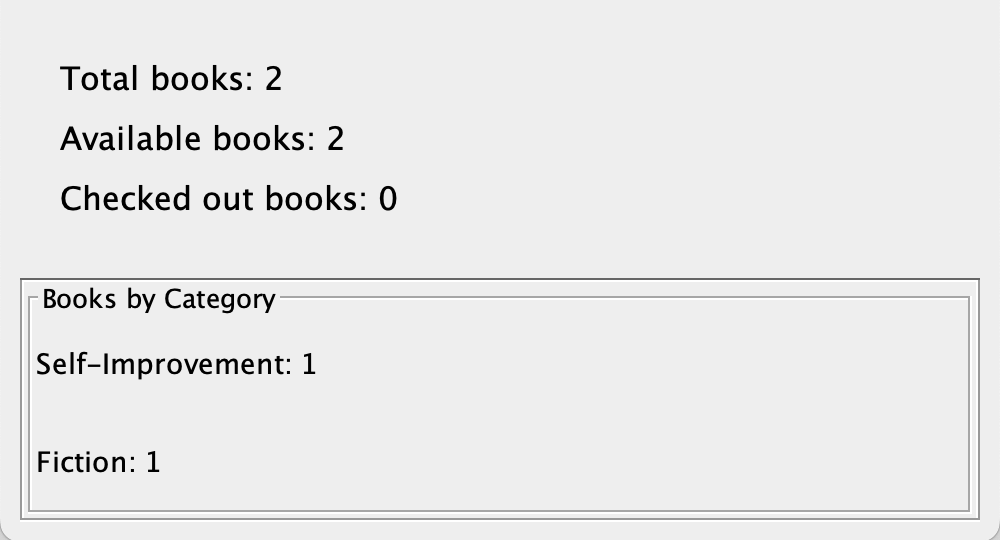
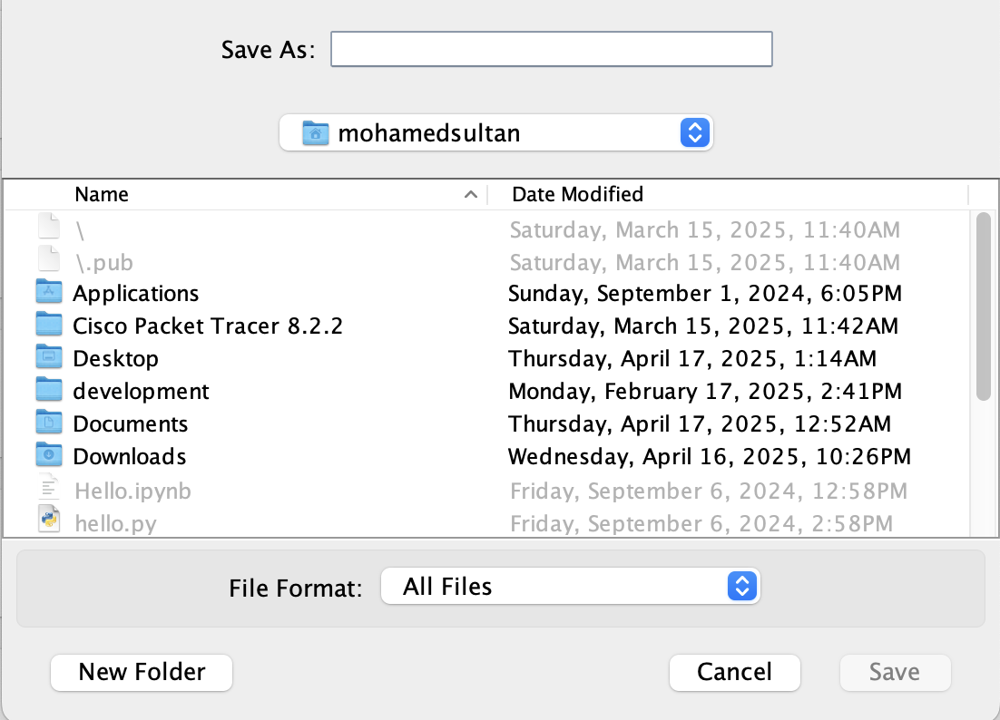
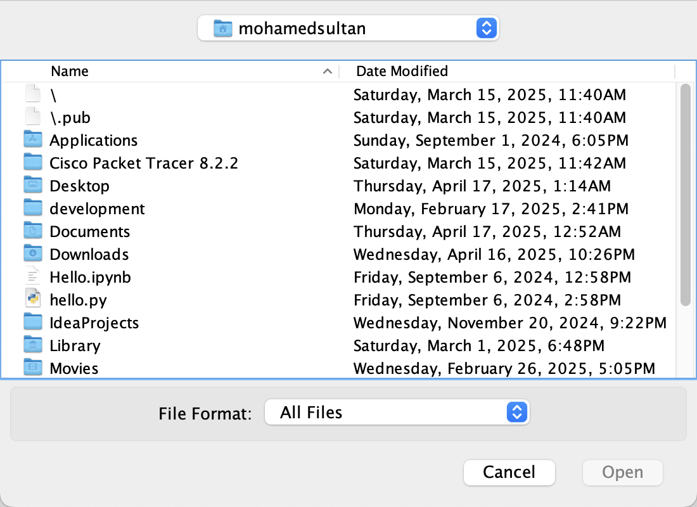

# 📚 Library Management System

A **Java Swing-based desktop application** that allows users to manage a virtual library of books. This system features a clean, user-friendly interface with options to add, search, manage, and import/export books.

Built using core Object-Oriented Programming principles and incorporates both the **Factory** and **Adapter** design patterns.

---

## 🔧 Features

- Add, view, and search for books
- Checkout and return books with detailed feedback
- Filter books by category and availability
- Export library to CSV
- Import legacy book data using Adapter pattern
- Display total and categorized book statistics
- Styled GUI with icons, title, logo, and improved layout

---

## 🧠 Design Patterns

### ✔️ Factory Pattern
- `BookFactory` is used to instantiate different types of books (`PhysicalBook`, `Ebook`) based on a type string.

### ✔️ Adapter Pattern
- `LegacyBookAdapter` wraps a `LegacyBook` object to adapt its interface to the `Book` interface expected by the system.

---

## 📰 GUI Preview










---

## 📁 Project Structure

```
/LibraryManagementSystem
  /src
    /library
      /models
      /factories
      /adapters
      /gui
  /assets
    library_logo.png
    *.png (button icons)
  /screenshots
    *.png
  README.md
```

---

## 🏃‍♂️ How to Run

1. Ensure Java (8 or higher) is installed on your machine
2. Open the project in an IDE like **VS Code**, **IntelliJ**, or use terminal
3. Navigate to the `/src` folder and compile:
   ```bash
   javac library/gui/LibraryManagementSystemGUI.java
   java library.gui.LibraryManagementSystemGUI
   ```
4. Alternatively, run via your IDE

---

## 👨‍💼 Author

**Mohamed Sultan**  
*Created as a final submission for SD4.2 Software Development Project, 2025.*

---